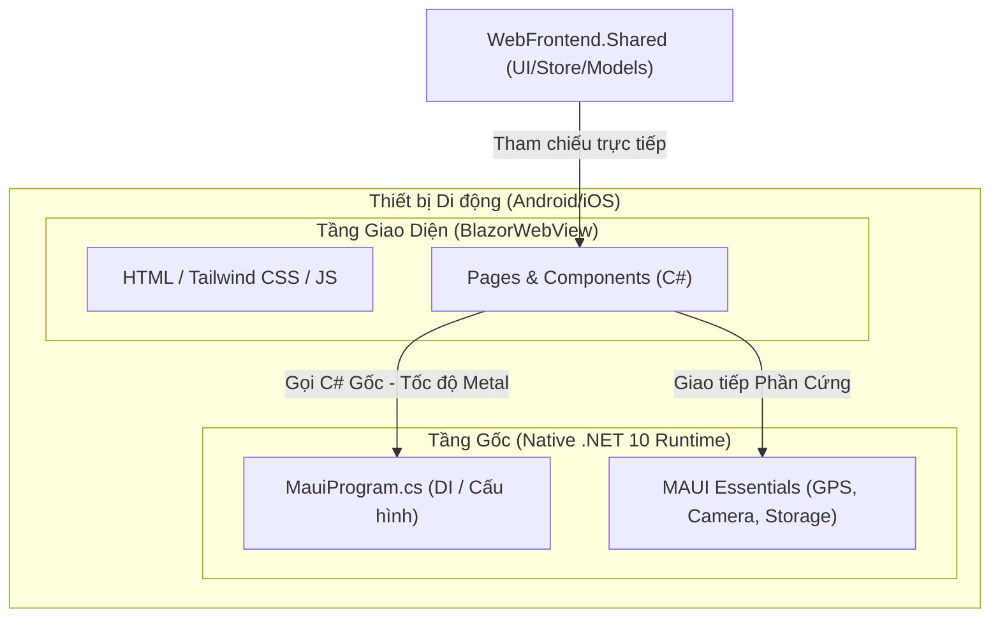

# Phương Pháp Phát Triển & Bản Đồ Kiến Thức .NET MAUI Blazor Hybrid - RATE

Tài liệu này được biên soạn nhằm giúp bạn hiểu rõ nguyên lý hoạt động của kiến trúc **.NET MAUI Blazor Hybrid**, phương pháp chia sẻ mã nguồn (Code Sharing), cách tương tác với phần cứng thiết bị di động và lộ trình hành động chi tiết mà tôi (Antigravity) sẽ cùng bạn thực hiện để hoàn thiện ứng dụng di động **RATE** một cách chuyên nghiệp nhất.

---

## 🏗️ 1. Bản chất của .NET MAUI Blazor Hybrid (Hiểu để làm chủ)

Khác với Blazor WebAssembly hay Hybrid Web Apps thông thường, **MAUI Blazor Hybrid** sở hữu cơ chế vận hành vô cùng đặc biệt:



> [!IMPORTANT]
> **Các đặc điểm cốt lõi:**
> 1. **C# chạy ở tốc độ Native**: Khi người dùng nhấn nút trên ứng dụng di động, các hàm xử lý C# (hoặc Fluxor State, Refit API) **không chạy trên trình duyệt giả lập (WASM)**. Chúng chạy trực tiếp trên máy ảo .NET 10 của hệ điều hành di động (Android Runtime/Mono runtime) bằng mã máy cực nhanh.
> 2. **WebView chỉ làm nhiệm vụ vẽ giao diện (Render UI)**: Trình duyệt `BlazorWebView` nhúng trong trang di động chỉ đóng vai trò là công cụ hiển thị HTML/CSS. Mọi logic nghiệp vụ chạy ở tầng C# gốc bên dưới, giúp app phản hồi cực kỳ nhanh nhạy.

---

## 🔌 2. Phương Pháp Cầu Nối Phần Cứng (Hardware Bridging Method)

Làm sao để một trang Razor dùng chung trong `WebFrontend.Shared` có thể vừa chạy trên Web (sử dụng API trình duyệt), vừa chạy trên Mobile (sử dụng API MAUI)? 

Chúng ta sử dụng **mô hình Trừu tượng hóa qua Interface (Dependency Injection Abstraction)**:

### Bước 1: Định nghĩa Interface chung trong `WebFrontend.Shared`
```csharp
namespace WebFrontend.Shared.Services;

public interface IDeviceService
{
    Task<string> GetLocationAsync(); // Lấy GPS rạp chiếu phim
    Task<string> CapturePhotoAsync(); // Chụp ảnh avatar
    Task SaveSecureTokenAsync(string key, string token); // Lưu token đăng nhập bảo mật
}
```

### Bước 2: Thực thi cụm chức năng trên Web (`WebFrontend/Services`)
Sử dụng các JavaScript Web APIs tiêu chuẩn:
```csharp
public class WebDeviceService : IDeviceService
{
    public async Task<string> GetLocationAsync()
    {
        // Sử dụng JSInterop để gọi navigator.geolocation của trình duyệt
        return await _jsRuntime.InvokeAsync<string>("getBrowserLocation");
    }
    // ...
}
```

### Bước 3: Thực thi cụm chức năng trên Mobile (`MobileApp/Services`)
Sử dụng thư viện Native gốc của MAUI Essentials:
```csharp
using Microsoft.Maui.Devices.Sensors;

public class MobileDeviceService : IDeviceService
{
    public async Task<string> GetLocationAsync()
    {
        // Gọi thẳng API định vị GPS của Android/iOS cực kỳ nhanh và chính xác
        var location = await Geolocation.Default.GetLocationAsync(new GeolocationRequest(GeolocationAccuracy.Medium));
        return $"{location.Latitude},{location.Longitude}";
    }
    // ...
}
```

### Bước 4: Đăng ký DI tương ứng trên từng dự án khởi chạy
* Trên Web (`Program.cs`): `builder.Services.AddScoped<IDeviceService, WebDeviceService>();`
* Trên Mobile (`MauiProgram.cs`): `builder.Services.AddSingleton<IDeviceService, MobileDeviceService>();`

Trang Razor của bạn chỉ cần Inject interface: `@inject IDeviceService DeviceService`. Khi chạy trên web nó sẽ tự dùng GPS trình duyệt, khi chạy trên Android nó sẽ tự dùng GPS của máy Android!

---

## 🗺️ 3. Lộ Trình Phát Triển 4 Giai Đoạn (The Roadmap)

Để hoàn thiện mô-đun di động này mà không ảnh hưởng tới phân hệ Web, chúng ta sẽ đi qua các giai đoạn sau:

### 📍 Giai đoạn 1: Khởi tạo Shell & Cấu hình dịch vụ (Hiện tại)
* **Việc cần làm**: Thiết lập khung cấu trúc dự án `src/MobileApp` bao gồm `MauiProgram.cs`, `App.xaml`, `MainPage.xaml` và cấu hình đăng ký DI cho hệ sinh thái (Fluxor, Refit, Fluent UI).
* **Mức độ an toàn**: 100% không ảnh hưởng Web.

### 📍 Giai đoạn 2: Tái cấu trúc Layout & CSS Tương thích di động (Mobile Responsive Layout)
* **Việc cần làm**: Rà soát lại `MainLayout.razor` và các page hiện tại. Cập nhật CSS Tailwind để giao diện tự động ẩn thanh menu Web lớn và hiển thị Bottom Navigation Bar khi chạy trên kích thước màn hình di động.
* **Mức độ an toàn**: Cực kỳ an toàn nhờ cơ chế grid và responsive của Tailwind.

### 📍 Giai đoạn 3: Hiện thực hóa 5 trang di động mới (Page Implementation)
* **Việc cần làm**: Viết code cho 5 trang mới trong `WebFrontend.Shared/Pages` bao gồm:
  1. `WelcomeOnboarding.razor` (Giới thiệu chào mừng).
  2. `ShowtimeSelection.razor` (Chọn suất chiếu và rạp).
  3. `SeatSelection.razor` (Chọn ghế ngồi).
  4. `ConcessionsSelection.razor` (Chọn bắp nước).
  5. `Checkout.razor` (Trang thanh toán).
* **Mức độ an toàn**: Chỉ tạo mới trang, không chỉnh sửa trang cũ.

### 📍 Giai đoạn 4: Đóng gói & Tích hợp phần cứng (Polish & Hardening)
* **Việc cần làm**: Tích hợp quét vé offline qua QR Code lưu local, đăng nhập một chạm FaceID, gửi Push Notification nhắc giờ chiếu phim.

---

## 🤝 4. Vai Trò Của Tôi (Antigravity) - Tôi Sẽ Làm Gì Giúp Bạn?

Khi chúng ta bắt tay vào làm việc, tôi sẽ đóng vai trò là một **Kỹ sư phát triển chính (Lead Developer)** đồng hành cùng bạn:

1. **Viết và sinh mã nguồn sạch (Clean Code Generation)**: Tôi sẽ tự động viết toàn bộ các file C#, XAML, Razor Page chuẩn Clean Architecture, sử dụng Primary Constructors (.NET 10), tuân thủ chặt chẽ nguyên lý SOLID và tối ưu hiệu năng.
2. **Cấu trúc & Cài đặt hệ thống (Infrastructure Setup)**: Tôi sẽ trực tiếp tạo cấu trúc dự án di động, đăng ký DI, liên kết API thông qua Refit và cấu hình định tuyến (Routing).
3. **Giải quyết xung đột & Debug**: Mỗi khi phát sinh lỗi biên dịch, xung đột NuGet hoặc cảnh báo MSBuild, tôi sẽ tiến hành phân tích log và tự động sửa đổi tệp cấu hình (csproj, props) để đưa hệ thống về trạng thái xanh mượt mà.
4. **Viết Backend API đồng bộ**: Khi các tính năng mobile mới cần dữ liệu (như thực đơn bắp nước), tôi sẽ tự viết các CQRS Command/Query ở backend (`src/Application`) và mở rộng Endpoint Web API tương thích.
5. **Lập tài liệu trực quan**: Cập nhật liên tục tiến độ qua tệp `task.md` và tạo các tài liệu hướng dẫn dễ hiểu ngay trong codebase của bạn.
